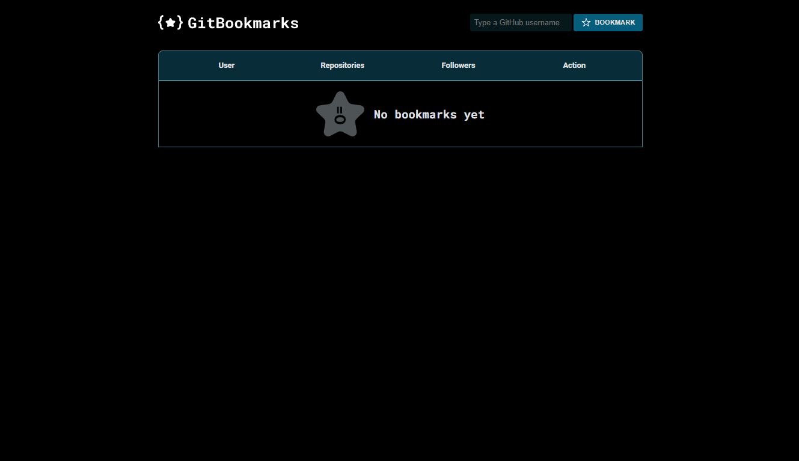

# Git Bookmarks

## About

A page for keeping a list of favorites [GitHub](https://github.com/) accounts under the browser's local storage.

## Run

Install [Live Server extension](https://marketplace.visualstudio.com/items?itemName=ritwickdey.LiveServer), right click on `index.html` file and then click on `Open with Live Server`.## Contributing

## Status

Done ✅

## License

[MIT](./LICENSE)
